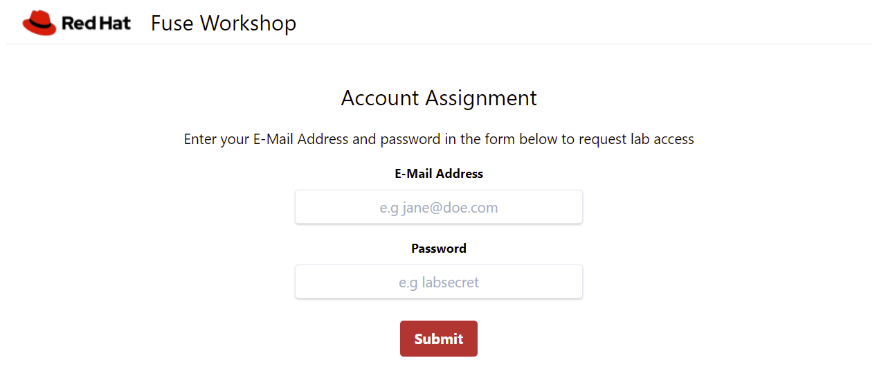

= Kafka Zero to Hero Workshop

This is a hands-on workshop that aims to give you basic practical experience with the main components of Kafka within the Kubernetes world using AMQ Streams, a Red Hat solution based on the Open Source https://strimz.io[Strimzi] project.

== Introduction

link:https://www.redhat.com/en/topics/integration/what-is-apache-kafka[Apache Kafka] has become the leading platform for building real-time data pipelines.  Today, Kafka is heavily used for developing event-driven applications,  where it lets services communicate with each other through events. Using Kubernetes for this type of workload requires adding specialized  components such as Kubernetes Operators and connectors to bridge the  rest of your systems and applications to the Kafka ecosystem.

AMQ streams, a link:https://www.redhat.com/en/products/application-foundations[Red Hat Application Foundation] component, makes Apache Kafka “OpenShift native” through the use of  powerful operators that simplify the deployment, configuration,  management, and use of Apache Kafka on Red Hat OpenShift.

== Audience

- Developers
- Architects
- Data Integrators

=== Duration

This workshop introduces participants to AMQ through a presentation and  hands-on lab format. This workshop is intended to be completed in a  half-day (4hrs) session.

== Agenda

=== Concepts - Kafka 101

Duration: 90 minutes with demos

https://docs.google.com/presentation/d/1CI5eRojj2KkcG_KmZtsRr_N75Y8vFEM6g-EVrpqId1M[Presentation Deck] (Red Hat Internal Only)

. Event Driven Architecture
. Kafka
. Kafka Brokers
. Kafka High Availability
. Kafka Leaders / Replicas
. Kafka Mirror Maker
. Kafka Store
. Kafka Security
. Kafka Connect vs Camel
. Kafka on Kubernetes (Strimzi)

Support material for this phase: Red Hat Developers x`x`- Kafka 101.

=== Labs

. link:./labs/00-kafka-install/walkthrough.adoc[Installing AMQ Streams (Kafka - Strimzi) on Openshift]

. link:./labs/01-production-ready-topologies/walkthrough.adoc[Production-ready topologies: sizing and persistence]

. link:./labs/02-topic-management/walkthrough.adoc[Topic management]

. link:./labs/03-clients-within-outside-ocp/walkthrough.adoc[Clients: within OCP and outside OCP]

. link:./labs/04-security/walkthrough.adoc[Security]

. link:./labs/05-observability/walkthrough.adoc[Observability]

. link:./labs/06-kafka-connect-debezium/walkthrough.adoc[Kafka Connect & Debezium]

. link:./labs/07-data-replication-with-mm/walkthrough.adoc[Replicating Data with MirrorMaker]

== Using the Ansible playbook

=== Parameters

[options="header"]
|=======================
| Parameter | Example Value                                      | Definition
| tkn | sha256~vFanQbthlPKfsaldJT3bdLXIyEkd7ypO_XPygY1DNtQ | Access token for a user with cluster-admin privileges.
| server    | https://api.cluster-xyz.xyz.sandbox9999.opentlc.com:6443                             | The cluster's OpenShift API URL
| num_users | 8                                                  | Number of users attending the workshop. Have in mind that the more users you have, more resources you are going to need from the cluster.
| delete_workshop | false | Only use this parameter if you intend to delete the installation and preserve the cluster.
|=======================

----
export tkn=sha256~UNFpoNDl1kPJ-nEhUzt-hljRpCBndpk66t1UycKj4Z4
export server=https://api.cluster-96npr.96npr.sandbox1420.opentlc.com:6443
export num_users=1
----

=== Running the playbook

- Replace the environment variable values:

----
export tkn=CHANGEME
export server=CHANGEME
export num_users=CHANGEME

cd ansible

ansible-playbook -e tkn=${tkn} -e server=${server} -e num_users=${num_users} playbook.yml
----

=== Getting the user registration page

The URL will be displayed by the `Installation Finished` task.

=== Contributing

We welcome all forms of contribution (content, issues/bugs, feedback).

