:walkthrough: Kafka 101 - Introduction
:codeready-url: {che-url}
:openshift-url: {openshift-host}
:user-password: openshift

= Lab 0 - Kafka 101 - Introduction

Welcome to the Kafka Zero to Hero Workshop! It's a pleasure to guide you on this hands-on experience.
+
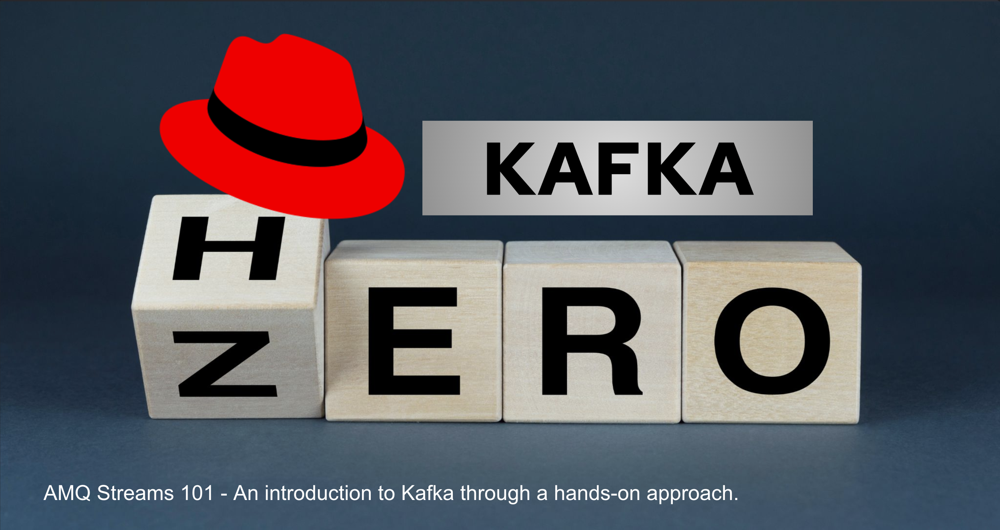

This workshop aims to offer you practical experience with Red Hat AMQ Streams, that is the productized and supported version of https://strimzi.io[Strimzi.io]. It is not meant to be a complete training of AMQ Streams. For this purpose we have amazing courses here https://www.redhat.com/en/services/training-and-certification[training and certification], covering many aspects of Red Hat AMQ Streams in depth.

The main objective is to cover as many Kafka aspects during this workshop.

*Credentials*

Use the following credentials to login into the web consoles:

* Your *username* is: `{user-username}` +
* Your *password* is: `{user-password}`

[type=walkthroughResource,serviceName=openshift]
.OpenShift Console
****
* link:{openshift-url}[Console, window="_blank"]
****

[time=2]
== Install the AMQ Streams Operator

Access the link:{openshift-url}[Openshift Console, window="_blank"] and login using the credentials provided username: {user-username} and password: {user-password}.

Our first step is to install the `AMQ Streams Operator`. As there are many students using this environment the role to install operator needed to be removed from your user. 

The Operator is already installed for you, so you can just skip to the next topic.

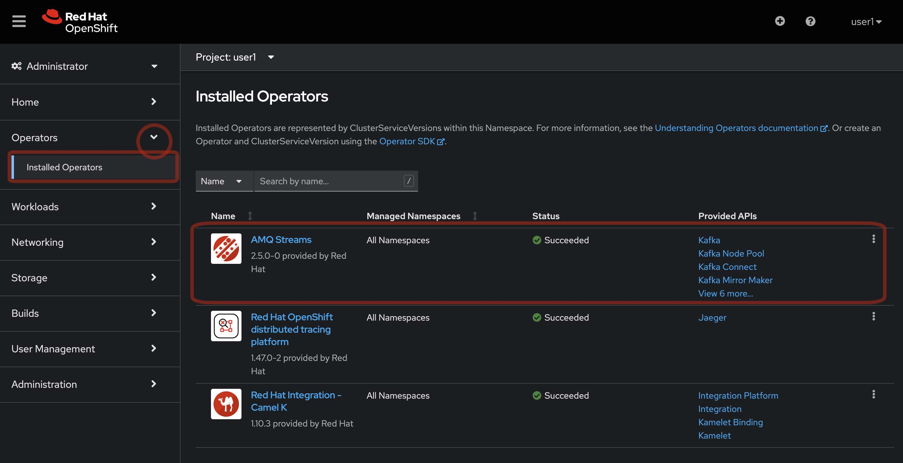 

Even if it's already installed is important to pass to this step, because it's the `AMQ Streams Operator` that does all the magic behind the tasks that we will be performing in the following labs. 

== Customizing the Openshift Developer Console

In order to be available those useful Kafka related resources in your Openshift menu we need to add them.
+
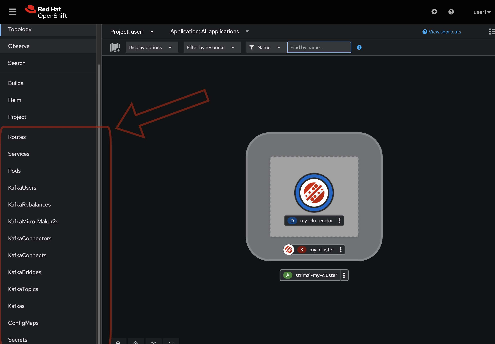 

* If you are in the *Administrator Perspective*, switch to the *Developer Perspective*.
+
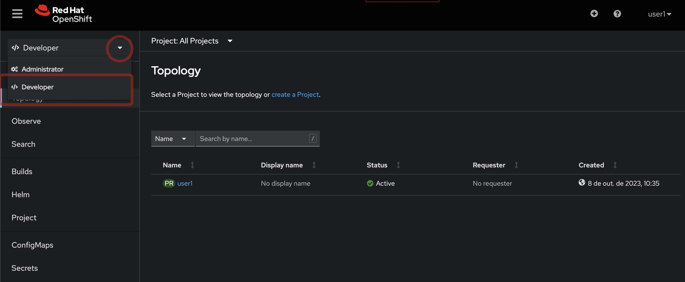 

* Add Kafka and KafkaTopic to the Dev console
  * Click on `Search` and search for the Kafka and KafkaTopic CR
  * Click on `add to navigation`
+
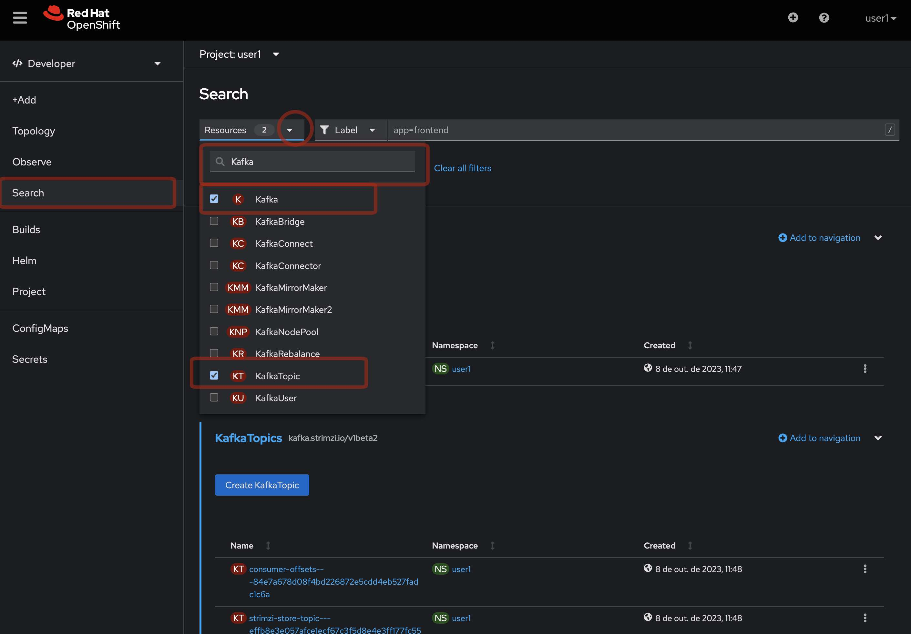 

After adding it, take a look that it's available on the menu in the side bar.
+
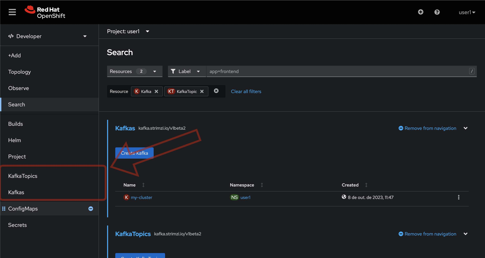 

* Repeat the same process to the add the following resources to the side menu:
  ** `KafkaBridge`
  ** `KafkaConnect`
  ** `KafkaConnector`
  ** `KafkaMirrorMaker2`
  ** `KafkaRebalance`
  ** `KafkaUser`
  ** `Service`
  ** `Route`
  ** `Pod`

* Your menu should look like this
+
 

[time=10]
== Install Kafka Cluster

* Go to the Developer Perspective
+
 

* Click on `Add` -> `Operator Backed`
+
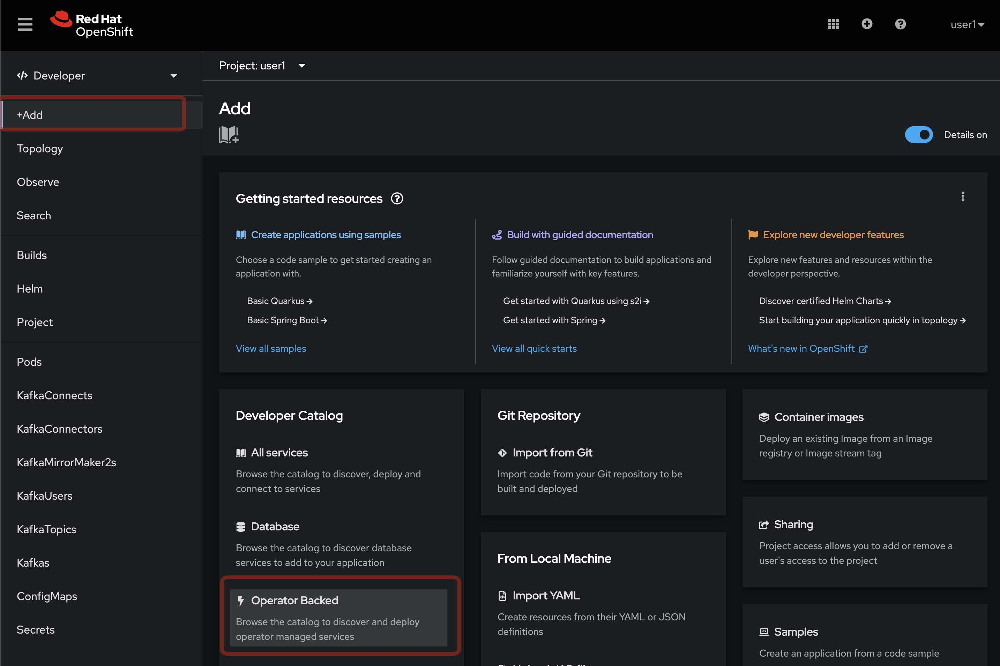

* Choose `Kafka`
+
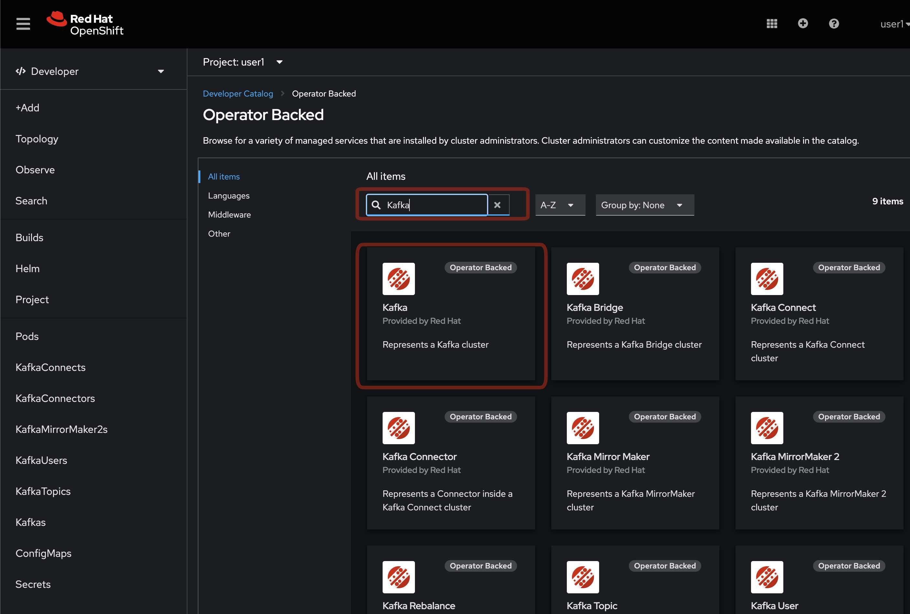

* And click on `Create` button
+
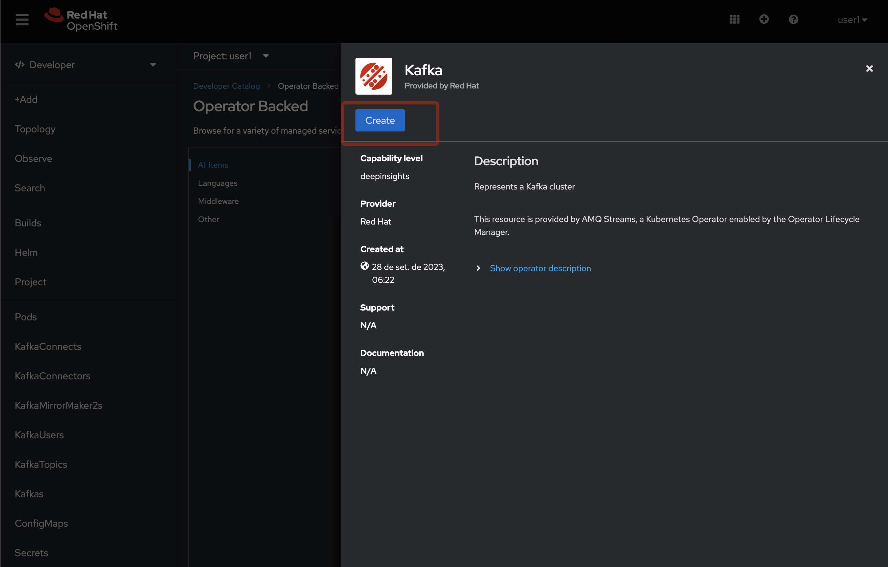 

* Explore the properties in the form and see what you are already familiarized and wich not, it's a good momento to raise some doubts with the instructor. 
If you do not have any, switch to the `YAML view` and take a look on all configuration, after just it the `Create` button.
+
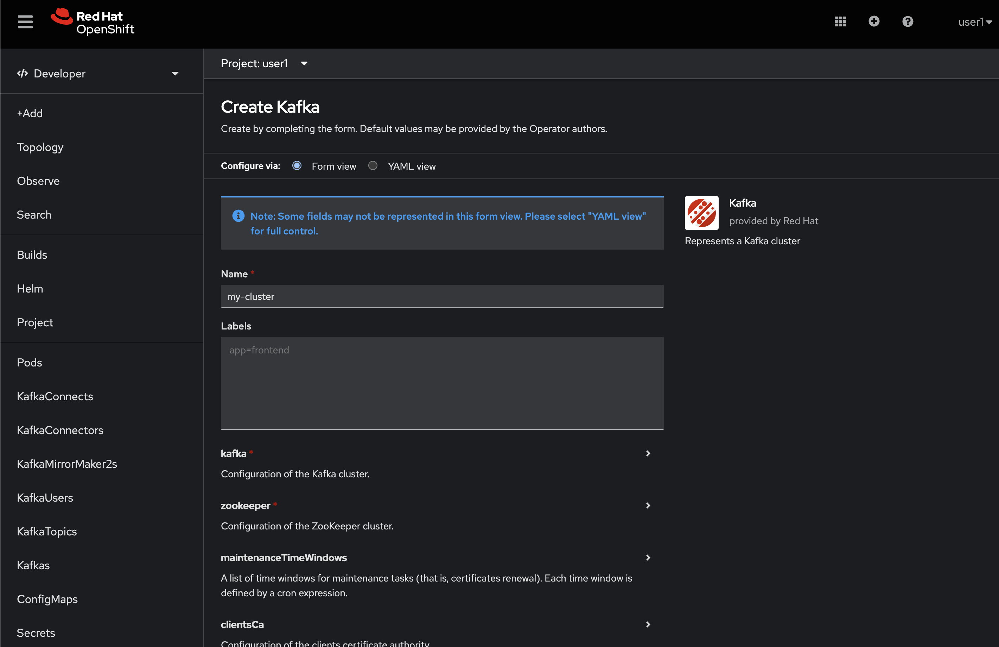

* Click on the `YAML View` to see what is being generated by the form. This definition is excellent for GitOps, after you defined the properties of you Kafka Cluster you can save this YAML definition and easily recreate how many times you want.
+
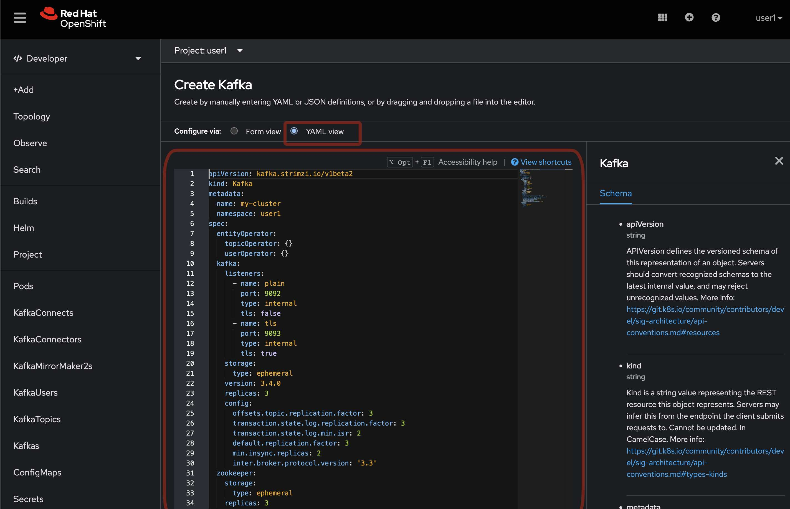

* Go to the `Pods` and look all the pods running that you have, you must have `3 zookeeper`, `3 kafka nodes` and `my-cluster-entity-operator` running with `Ready` status.
+
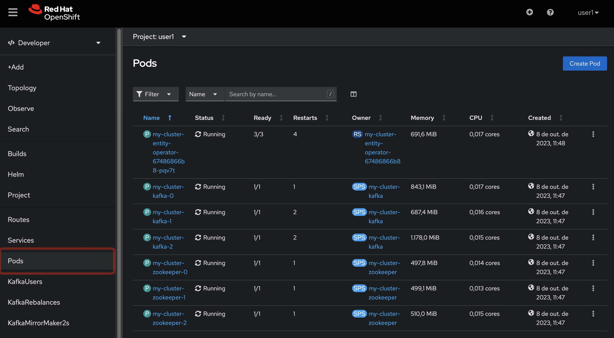 

* The pods are not showing in the `Topology` view, because it's Strimzi Pod Sets, if you need to know more about that, https://strimzi.io/blog/2022/05/23/strimzipodsets-what-it-is-and-why-should-you-care/[take a look on this video] from `Jakub Scholz`.

The Kafka Cluster is already installed and ready to use. 

* On the pod list, select the `zookeeper` pod and go to the `Metrics` tab and observe the consume of cpu, memory and networking, also take a look on the other metrics available.
+
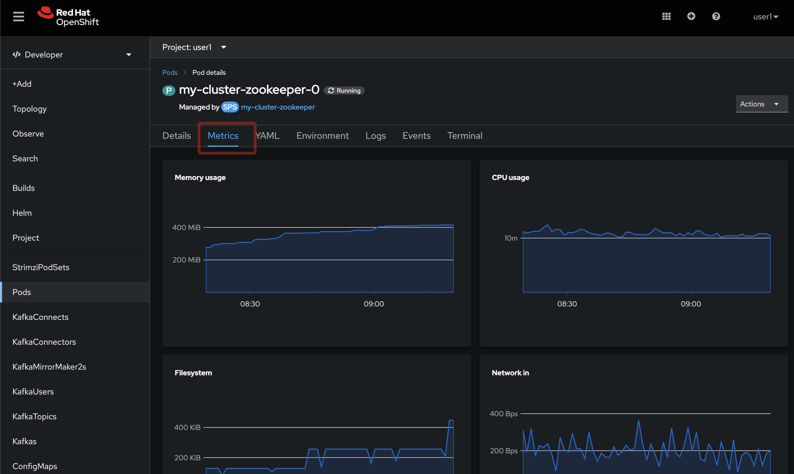 

* Repeat the same process to the Kafka broker.
+
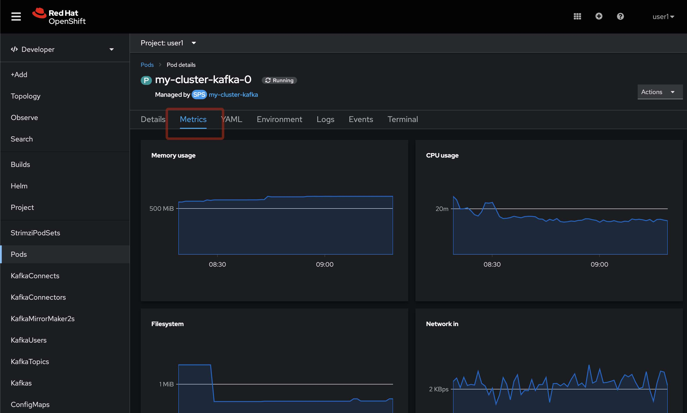 

=== Create a Kafka Topic

* Make sure you are in the right project and click on `Add` -> `Operator Backed`

image::4-10-2020-09-49-14-AM.png[] 

* Now choose `Kafka Topic` and then `Create`

image::4-10-2020-16-06-32-PM.png[] 

image::4-10-2020-16-06-58-PM.png[] 

* Fill out the forms using the values:
** Name: `first-topic`
** Partitions: `3`
** Replication Factor: 3
* And now click on `Create`

image::4-10-2020-16-45-55-PM.png[] 

* You can use the YAML editor as well:

image::2-10-2020-10-44-10-AM.png[]  

[source,yaml]
----
apiVersion: kafka.strimzi.io/v1beta1
kind: KafkaTopic
metadata:
  name: first-topic
  labels:
    strimzi.io/cluster: my-cluster
  namespace: strimzi-operator
spec:
  config:
    retention.ms: 604800000
    segment.bytes: 1073741824
  partitions: 3
  replicas: 3
  topicName: first-topic
----

Now let's set some vars

[variables]
[source,bash]
----
export KAFKA_NAMESPACE=kafka-demo
export KAFKA_CLUSTER=my-cluster
export ZOOKEEPER_HOST=localhost:2181
export BROKER_HOST=localhost:9092
export ZOOKEEPER_POD=$(oc -n $KAFKA_NAMESPACE get pods -l app.kubernetes.io/name=zookeeper -o=jsonpath='{.items[0].metadata.name}')
export KAFKA_BROKER_POD=$(oc -n $KAFKA_NAMESPACE get pods -l app.kubernetes.io/name=kafka -o=jsonpath='{.items[0].metadata.name}')
export SUBDOMAIN=$(oc get ingresses.config.openshift.io -o jsonpath='{.items[0].spec.domain}')
echo
echo $ZOOKEEPER_POD
echo $KAFKA_BROKER_POD
echo $SUBDOMAIN
----

[source,bash]
----
oc -n $KAFKA_NAMESPACE exec -it $KAFKA_BROKER_POD -c kafka -- bin/kafka-topics.sh \
    --list \
    --bootstrap-server $KAFKA_CLUSTER-kafka-bootstrap.$KAFKA_NAMESPACE.svc:9092
----

image::2-10-2020-11-35-33-AM.png[] 

[source,bash]
----
oc -n $KAFKA_NAMESPACE exec -it $KAFKA_BROKER_POD -c kafka -- bin/kafka-topics.sh \
    --bootstrap-server $KAFKA_CLUSTER-kafka-bootstrap.$KAFKA_NAMESPACE.svc:9092 \
    --topic first-topic \
    --describe
----

image::2-10-2020-11-36-48-AM.png[] 

===== Create Topic Using Kafka CLI

Create topic using kafka-topics.sh

[source,bash]
----
oc -n $KAFKA_NAMESPACE exec -it $KAFKA_BROKER_POD -c kafka -- bin/kafka-topics.sh \
    --create \
    --bootstrap-server $KAFKA_CLUSTER-kafka-bootstrap.$KAFKA_NAMESPACE.svc:9092 \
    --replication-factor 1 \
    --partitions 2 \
    --topic second-topic
----

List topics

[source,bash]
----
oc -n $KAFKA_NAMESPACE exec -it $KAFKA_BROKER_POD -c kafka -- bin/kafka-topics.sh \
    --list \
    --bootstrap-server $KAFKA_CLUSTER-kafka-bootstrap.$KAFKA_NAMESPACE.svc:9092
----

image::2-10-2020-17-30-37-PM.png[] 

We can see the Kafka Topic CR was created as well:

image::2-10-2020-17-32-30-PM.png[] 

We can also check that by running:

[source,bash]
----
oc get kafkatopic -n $KAFKA_NAMESPACE
----

image::4-10-2020-17-02-32-PM.png[] 

=== Producer and Consumer

Now let's producer some messages.

Open the command below in a terminal tab

.producer
[source,bash]
----
oc -n $KAFKA_NAMESPACE exec -it $KAFKA_BROKER_POD -c kafka -- bin/kafka-console-producer.sh \
    --broker-list $BROKER_HOST \
    --topic first-topic
----

Open the command below in another terminal tab:

.consumer
[source,bash]
----
oc -n $KAFKA_NAMESPACE exec -it $KAFKA_BROKER_POD -c kafka -- bin/kafka-console-consumer.sh \
    --bootstrap-server $BROKER_HOST \
    --topic first-topic
----

TIP: Do not forget to <<variables,set the requirement variables>>

Anything you write in the producer tab, will be shown in the consumer tab.

image::2-10-2020-17-58-00-PM.png[] 

=== VR Application

Take note of the bootstrap service from your kafka cluster. We will need it in the next labs.

image::2-10-2020-18-21-57-PM.png[] 

And use it in the `KAFKA_BROKER` variable:

[source,bash]
----
oc process -f vr-template.yml \
  -p NAMESPACE=$KAFKA_NAMESPACE \
  -p KAFKA_BROKER=my-cluster-kafka-bootstrap:9092 \
  -p KAFKA_TOPIC=third-topic \
  -p SUBDOMAIN=$SUBDOMAIN \
  | oc apply -f -
----

After running this, we will see a new application in the developer console:

image::3-10-2020-10-38-26-AM.png[] 

Now, Open the Camel VR Route

image::3-10-2020-10-40-09-AM.png[] 

We will see the VR Application:

image::3-10-2020-10-45-08-AM.png[] 

Now click many times on the `Send Event` to send message to the `third-topic`:

image::3-10-2020-10-45-53-AM.png[] 

We will see the message flowing throught the kafka Consumer and the offset 0 will be created.

image::3-10-2020-10-47-19-AM.png[] 

Now open the swagger url:

image::3-10-2020-10-48-41-AM.png[] 

Open a new tab with the same a application URL and concatenate the following in the end of the url: `/webjars/swagger-ui/2.1.0/index.html?url=/camel/api-docs`

image::3-10-2020-10-50-02-AM.png[] 

=== Consumer and Producer Application

Now let's create another topic: `forth-topic`

For that, let's use the import yaml editor.

image::4-10-2020-17-28-42-PM.png[] 

And paste the following yaml:

[source,yaml]
----
apiVersion: kafka.strimzi.io/v1beta1
kind: KafkaTopic
metadata:
  name: forth-topic
  labels:
    strimzi.io/cluster: my-cluster
  namespace: kafka-demo
spec:
  config:
    retention.ms: 604800000
    segment.bytes: 1073741824
  partitions: 3
  replicas: 3
  topicName: forth-topic
----

Let's see if it was created corretly:

[source,bash]
----
oc -n $KAFKA_NAMESPACE exec -it $KAFKA_BROKER_POD -c kafka -- bin/kafka-topics.sh \
    --bootstrap-server $BROKER_HOST \
    --topic forth-topic \
    --describe
----

Now let's deploy the consumer and producer.

[source,bash]
----
oc process -f consumer-producer-template.yml \
  -p NAMESPACE=$KAFKA_NAMESPACE \
  -p TOPIC=forth-topic \
  -p KAFKA_BROKER=my-cluster-kafka-bootstrap:9092 \
  | oc apply -f -
----

Wait for both pods become ready and run:

[source,bash]
----
oc logs --tail 100 -f $(oc get pods -l app=hello-world-producer -o jsonpath='{.items[0].metadata.name}')
----

[source,bash]
----
oc logs --tail 100 -f $(oc get pods -l app=hello-world-consumer -o jsonpath='{.items[0].metadata.name}')
----

Your terminal should be like this:

image::4-10-2020-19-00-43-PM.png[] 

[time=1]
== Summary

Congratulations, you finished the Kafka 101 Lab.

