:walkthrough: Kafka 101 - Introduction
:openshift-url: {openshift-host}
:user-password: openshift
:devspaces-url: http://devspaces.{openshift-app-host}/

= Lab 0 - Kafka 101 - Introduction

Welcome to the Kafka Zero to Hero Workshop! It's a pleasure to guide you on this hands-on experience.

{empty} +

image::./images/kafka-zero-to-hero-workshop.png[Kafka Zero to Hero Workshop]

This workshop aims to offer you practical experience with Red Hat AMQ Streams, that is the productized and supported version of https://strimzi.io[Strimzi.io]. It is not meant to be a complete training of AMQ Streams. For this purpose we have amazing courses here https://www.redhat.com/en/services/training-and-certification[training and certification], covering many aspects of Red Hat AMQ Streams in depth.

The main objective is to cover as many Kafka aspects during this workshop.

*Credentials*

Use the following credentials to login into the web consoles:

* Your *username* is: `{user-username}` +
* Your *password* is: `{user-password}`

[type=walkthroughResource,serviceName=devspace]
.Dev Spaces (IDE)
****
* link:{devspaces-url}[Console, window="_blank", , id="resources-devspace-url"]
****
[type=walkthroughResource]
.OpenShift Console
****
* link:{openshift-url}/topology/ns/{namespace}[Topology View, window="_blank"]
****

[time=2]
== Install the AMQ Streams Operator

Access the link:{openshift-url}[Openshift Console, window="_blank"] and login using the credentials provided username: {user-username} and password: {user-password}.

Our first step is to install the `AMQ Streams Operator`. As there are many students using this environment the role to install operator needed to be removed from your user. 

The Operator is already installed for you, so you can just skip to the next topic.

image::images/operators-installed.jpg[Installed Operators] 

Even if it's already installed is important to pass to this step, because it's the `AMQ Streams Operator` that does all the magic behind the tasks that we will be performing in the following labs. 

[time=5]
== Customizing the Openshift Developer Console

. In order to be available those useful Kafka related resources in your Openshift menu we need to add them.
+
image::images/kafka-side-menu-full.jpg[] 

. If you are in the *Administrator Perspective*, switch to the *Developer Perspective*.
+
image::images/developer.jpg[] 

. Add Kafka and KafkaTopic to the Dev console
.. Click on `Search` and search for the `Kafka` and `KafkaTopic` Custom Resource and click on `add to navigation`
+
image::images/kafka-side-menu.jpg[] 

. After adding it, take a look that it's available on the menu in the side bar.
+
image::images/kafka-side-menu-2.jpg[] 

* Repeat the same process to the add the following resources to the side menu:
  ** `KafkaBridge`
  ** `KafkaConnect`
  ** `KafkaConnector`
  ** `KafkaMirrorMaker2`
  ** `KafkaRebalance`
  ** `KafkaUser`
  ** `Service`
  ** `Route`
  ** `Pod`

* Your menu should look like this
+
image::images/kafka-side-menu-full.jpg[] 

[time=10]
== Install Kafka Cluster

. Go to the Developer Perspective
+
image::images/developer.jpg[Developer Perspective] 

. Click on `Add` -> `Operator Backed`
+
image::images/add.jpg[Operator Backed]

. Choose `Kafka`
+
image::images/add-kafka.jpg[Kafka]

. And click on `Create` button
+
image::images/kafka-create.jpg[Kafka] 

Explore the properties in the form and see what you are already familiarized and wich not, it's a good momento to raise some doubts with the instructor. 
If you do not have any, switch to the `YAML view` and take a look on all configuration.

. Click on the `Create` button.
+
image::images/kafka-create-2.png[Kafka]

. Click on the `YAML View` to see what is being generated by the form. This definition is excellent for GitOps, after you defined the properties of you Kafka Cluster you can save this YAML definition and easily recreate how many times you want.
+
image::images/kafka-create-3.jpg[Kafka]

. Go to the `Pods` and look all the pods running that you have, you must have `3 zookeeper`, `3 kafka nodes` and `my-cluster-entity-operator` running with `Ready` status.
+
image::images/pod-list.jpg[] 

[NOTE]
====
The pods are not showing in the `Topology` view, because it's Strimzi Pod Sets, if you need to know more about that, https://strimzi.io/blog/2022/05/23/strimzipodsets-what-it-is-and-why-should-you-care/[take a look on this video] from `Jakub Scholz`
====

{empty} +

The Kafka Cluster is already installed and ready to use. 

{empty} +

Let's explore some metrics available `out of the box` in the `Openshift`.

. On the pod list, select the `zookeeper` pod and go to the `Metrics` tab and observe the consume of cpu, memory and networking, also take a look on the other metrics available.
+
image::images/pod-monitoring-zk.jpg[] 

. Repeat the same process to the Kafka broker.
+
image::images/pod-monitoring-broker.jpg[]

[time=5]
== Create a Kafka Topic

. Make sure you are in the right project and click on `Add` -> `Operator Backed`
+
image::images/add.jpg[Operator Backed]

. Now find for `Topic` and select the `Kafka Topic` option
+
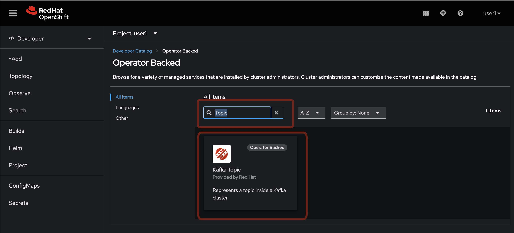 

. Click on the `Create` button
+
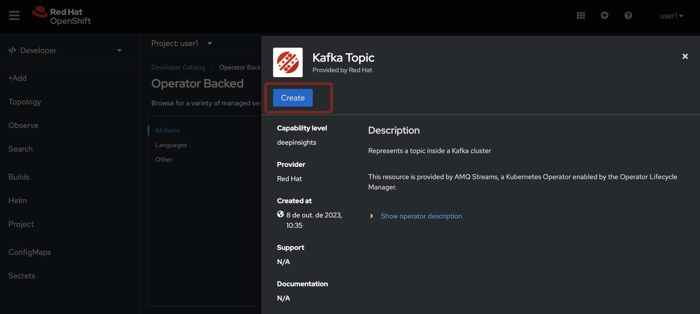  

. Fill out the forms using the values:
.. Name: `first-topic`
.. Partitions: `3`
.. Replication Factor: 3
And now click on `Create`

{empty} +

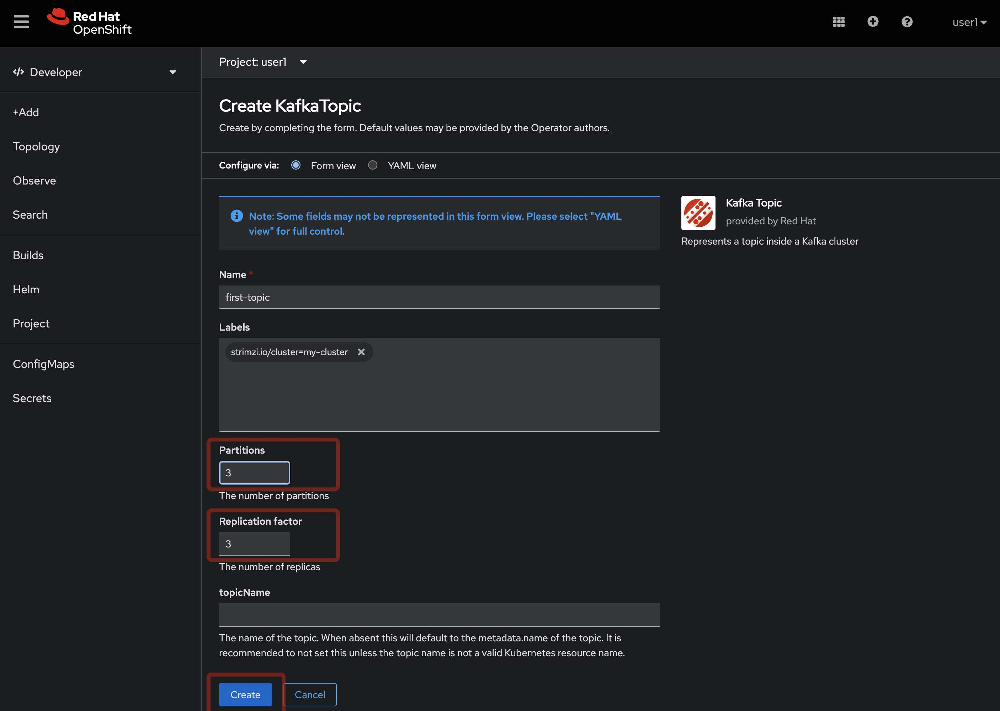 

. Look at the `YAML View`.
+
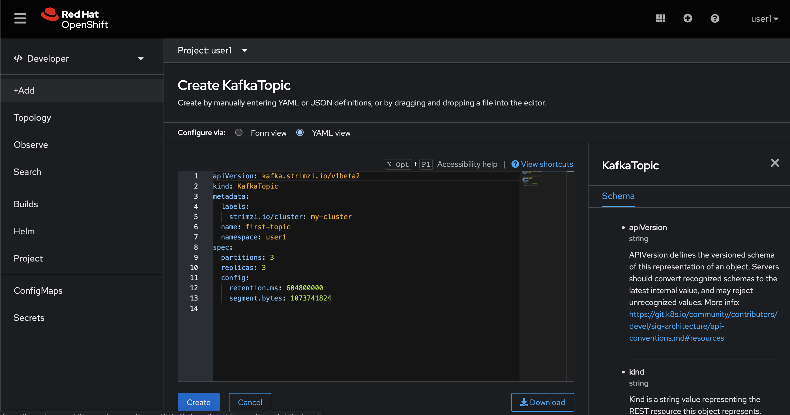 

. To check the complete list of the topics, access the `Kafka Topics` in the left side menu. 
+
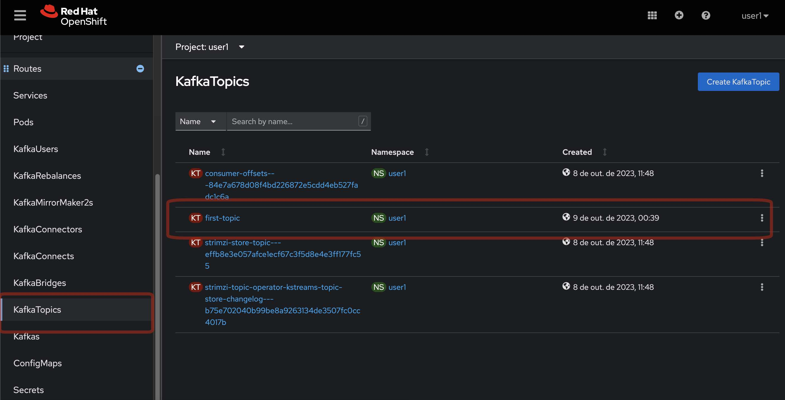 

{empty} +

In the Kafka vanilla to access the list of topics you need to use a `Kafka CLI` tool to do it. Let's access the command line and see how it is performed.

. Access your IDE environment in link:{devspaces-url}[Red Hat Openshift Devspaces, window="_blank"]

. Click in `Open`
+
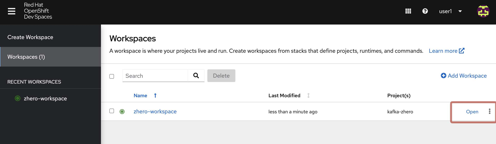

{empty} +

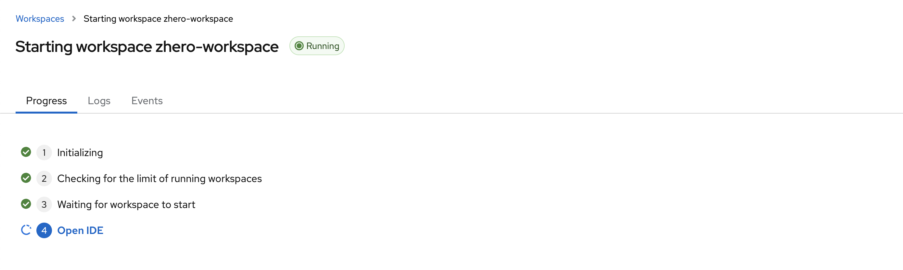

== Topics from the Command Line

. Access the broker 0 pod Terminal.
.. From the list of Pods in the left side menu, acces the broker 0 pod, and in the tabs select `Terminal`.
+
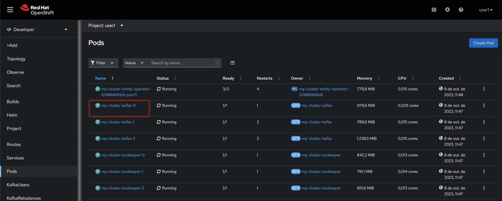

. List the topics using the `kafka-topics` command line tool

[source,bash]
----
bin/kafka-topics.sh \
    --list \
    --bootstrap-server my-cluster-kafka-bootstrap:9092
----
+
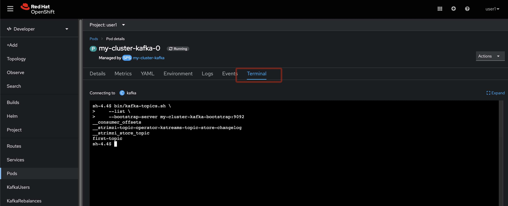

. Describe the topic `first-topic`

[source,bash]
----
bin/kafka-topics.sh \
    --bootstrap-server my-cluster-kafka-bootstrap:9092 \
    --topic first-topic \
    --describe
----
+
image::images/cli-describe-topic.jpg[]

. Now let's create a new topic still using the command line, named `second-topic`

[source,bash]
----
bin/kafka-topics.sh \
    --create \
    --bootstrap-server my-cluster-kafka-bootstrap:9092 \
    --replication-factor 1 \
    --partitions 2 \
    --topic second-topic
----
+
image::images/cli-create-topic.jpg[]

. List the topics again to see the newly topic created.

----
bin/kafka-topics.sh \
    --list \
    --bootstrap-server my-cluster-kafka-bootstrap:9092
----
+
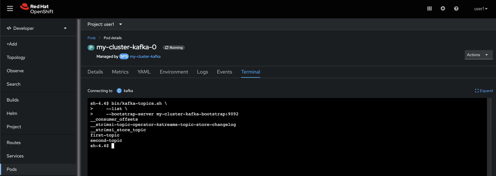

. Take a look if the topics created by the command line is appearing in the `Kafka Topics` list in Openshift
+
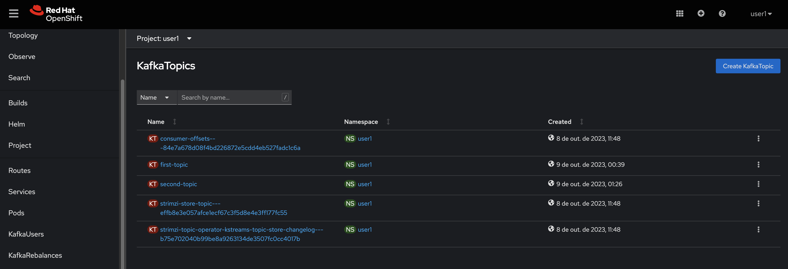

Easier from the UI, isn't it? :-)

[time=5]
== Deploy an application to Produce/Consume from Kafka

Take note of the bootstrap service from your kafka cluster. We will need it in the next labs.

image::2-10-2020-18-21-57-PM.png[] 

And use it in the `KAFKA_BROKER` variable:

[source,bash]
----
oc process -f vr-template.yml \
  -p NAMESPACE=$KAFKA_NAMESPACE \
  -p KAFKA_BROKER=my-cluster-kafka-bootstrap:9092 \
  -p KAFKA_TOPIC=third-topic \
  -p SUBDOMAIN=$SUBDOMAIN \
  | oc apply -f -
----

After running this, we will see a new application in the developer console:

image::3-10-2020-10-38-26-AM.png[] 

Now, Open the Camel VR Route

image::3-10-2020-10-40-09-AM.png[] 

We will see the VR Application:

image::3-10-2020-10-45-08-AM.png[] 

Now click many times on the `Send Event` to send message to the `third-topic`:

image::3-10-2020-10-45-53-AM.png[] 

We will see the message flowing throught the kafka Consumer and the offset 0 will be created.

image::3-10-2020-10-47-19-AM.png[] 

Now open the swagger url:

image::3-10-2020-10-48-41-AM.png[] 

Open a new tab with the same a application URL and concatenate the following in the end of the url: `/webjars/swagger-ui/2.1.0/index.html?url=/camel/api-docs`

image::3-10-2020-10-50-02-AM.png[] 

=== Consumer and Producer Application

Now let's create another topic: `forth-topic`

For that, let's use the import yaml editor.

image::4-10-2020-17-28-42-PM.png[] 

And paste the following yaml:

[source,yaml]
----
apiVersion: kafka.strimzi.io/v1beta1
kind: KafkaTopic
metadata:
  name: forth-topic
  labels:
    strimzi.io/cluster: my-cluster
  namespace: kafka-demo
spec:
  config:
    retention.ms: 604800000
    segment.bytes: 1073741824
  partitions: 3
  replicas: 3
  topicName: forth-topic
----

Let's see if it was created corretly:

[source,bash]
----
oc -n $KAFKA_NAMESPACE exec -it $KAFKA_BROKER_POD -c kafka -- bin/kafka-topics.sh \
    --bootstrap-server $BROKER_HOST \
    --topic forth-topic \
    --describe
----

Now let's deploy the consumer and producer.

[source,bash]
----
oc process -f consumer-producer-template.yml \
  -p NAMESPACE=$KAFKA_NAMESPACE \
  -p TOPIC=forth-topic \
  -p KAFKA_BROKER=my-cluster-kafka-bootstrap:9092 \
  | oc apply -f -
----

Wait for both pods become ready and run:

[source,bash]
----
oc logs --tail 100 -f $(oc get pods -l app=hello-world-producer -o jsonpath='{.items[0].metadata.name}')
----

[source,bash]
----
oc logs --tail 100 -f $(oc get pods -l app=hello-world-consumer -o jsonpath='{.items[0].metadata.name}')
----

Your terminal should be like this:

image::4-10-2020-19-00-43-PM.png[] 

[time=1]
== Summary

Congratulations, you finished the Kafka 101 Lab.

