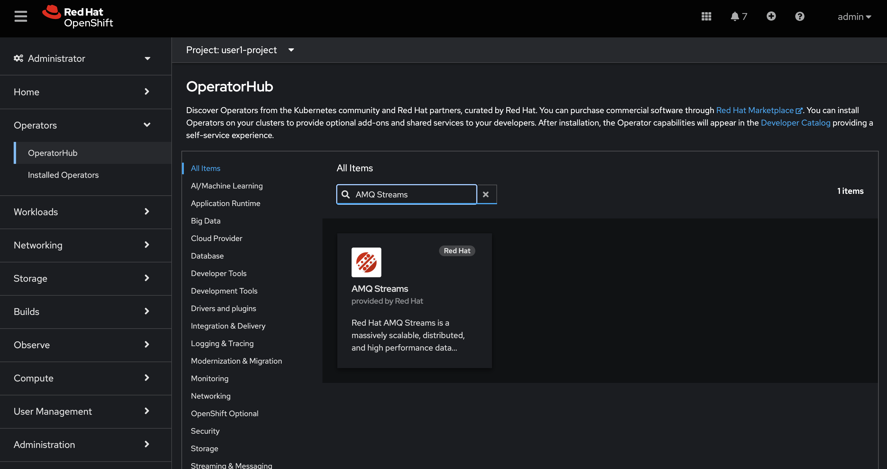
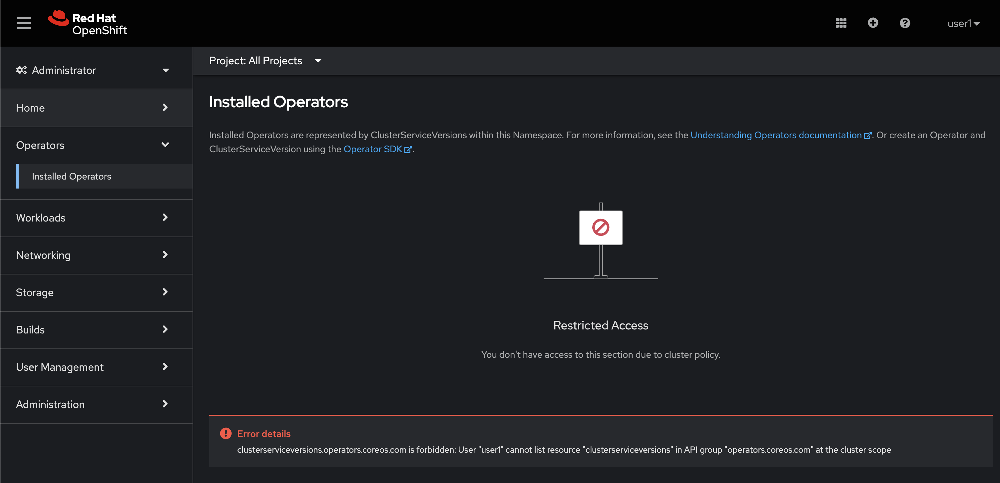
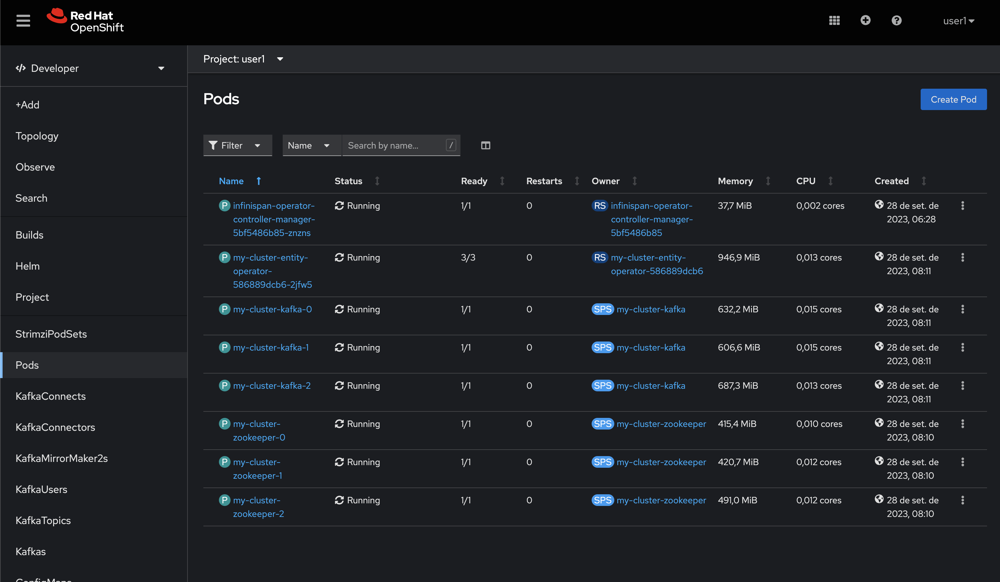
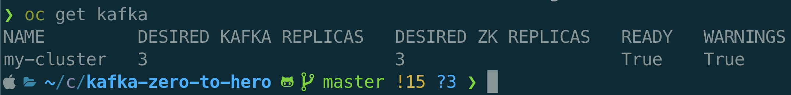

:walkthrough: Welcome and Installing Kafka
:codeready-url: {che-url}
:openshift-url: {openshift-host}
:user-password: openshift

= Lab 0 - Welcome and Installing Kafka

Welcome to the Kafka Zero to Hero Workshop! It's a pleasure to guide you on this hands-on experience.

This workshop aims to offer you practical experience with Red Hat AMQ Streams, that is the productized and supported version of https://strimzi.io[Strimzi.io]. It is not meant to be a complete training of AMQ Streams. For this purpose we have amazing courses here https://www.redhat.com/en/services/training-and-certification[training and certification], covering many aspects of Red Hat AMQ Streams in depth.

The main objective is to cover as many Kafka aspects during this workshop.

[type=walkthroughResource,serviceName=codeready]
.CodeReady Workspaces
****
* link:{codeready-url}[Console, window="_blank"]
* link:https://developers.redhat.com/products/codeready-workspaces/overview/[Want to know more about CodeReady Workspaces?, window="_blank"]
****

[type=walkthroughResource,serviceName=openshift]
.OpenShift Console
****
* link:{openshift-url}[Console, window="_blank"]
****

[time=2]
== Install the AMQ Streams Operator

Our first step is to install the AMQ Streams Operator. As there are many students using this environment the role to install operator needed to be removed from your user. 

So, if you follow the steps:

* Access the Administrator console
* Click on Operators -> OperatorHub
* Search for AMQ Streams

 

And proceed with the wizard to finish the installation. 

Instead, if you try to access it, you should see a permission message problem on the screen.

 

Even if it's already installed is important to pass to this step, because it's the `AMQ Streams Operator` that does all the magic behind the other operations that we will be performing in the labs. 

[time=10]
== Install Kafka Cluster

* Go to the Developer Perspective

image::4-10-2020-09-46-46-AM.png[] 

* Click on `Add` -> `Operator Backed`

image::4-10-2020-09-49-14-AM.png[] 

* Choose `Kafka`

image::4-10-2020-09-50-14-AM.png[] 

* And click on `Create` button

image::4-10-2020-09-51-08-AM.png[] 

* Explore a little the properties in the form and see what you are already familiarized and wich not, it's a good momento to raise some doubts with the instructor. 
If you do not have any, switch to the `YAML view` and take a look on all configuration, after just it the `Create` button.

image::2-10-2020-10-00-35-AM.png[] 

* Here you have the full yaml. If you want, you can copy and paste

[source,yaml]
----
apiVersion: kafka.strimzi.io/v1beta2
kind: Kafka
metadata:
  name: my-cluster
spec:
  entityOperator:
    topicOperator: {}
    userOperator: {}
  kafka:
    listeners:
      - name: plain
        port: 9092
        type: internal
        tls: false
      - name: tls
        port: 9093
        type: internal
        tls: true
    storage:
      type: ephemeral
    version: 3.4.0
    replicas: 3
    config:
      offsets.topic.replication.factor: 3
      transaction.state.log.replication.factor: 3
      transaction.state.log.min.isr: 2
      default.replication.factor: 3
      min.insync.replicas: 2
      inter.broker.protocol.version: '3.3'
  zookeeper:
    storage:
      type: ephemeral
    replicas: 3

----

After you cluster is installed, in the `Pods` view you will see:

 

You can also see the Kafka cluster using the oc command:

[source,bash]
----
oc get kafka
----

 

=== Developer Console

==== Customizing the Dev Console

image::2-10-2020-10-02-47-AM.png[] 

* If you are in the Administration Perspective, switch to Developer Perspective
* Add Kafka, KafkaTopic to the Dev console
  * Click on `Search` and search for the Kafka and KafkaTopic CR
  * Click on `add to navigation`

image::2-10-2020-10-05-11-AM.png[] 

image::2-10-2020-10-06-21-AM.png[] 

image::2-10-2020-10-06-58-AM.png[] 

* Repeat the same process to the add the following resources to the side menu:
  ** `KafkaBridge`
  ** `KafkaConnect`
  ** `KafkaConnector`
  ** `KafkaMirrorMaker2`
  ** `KafkaRebalance`
  ** `Service`
  ** `Route`

* Your menu should look like that

image::4-10-2020-10-25-34-AM.png[] 

* You can remove any item on the menu by clicking on the `(-)` . It will appear when you hover the mouse over the item.

image::4-10-2020-10-21-31-AM.png[] 

* And then `Remove` from navigation

image::4-10-2020-10-22-17-AM.png[] 

==== Explore the Dev Console

* After Kafka cluster is fully installed, you can see the Details, Resources and Monitoring

image::2-10-2020-10-34-11-AM.png[] 

image::2-10-2020-10-32-36-AM.png[] 

image::2-10-2020-10-35-06-AM.png[] 

image::2-10-2020-10-36-20-AM.png[] 

==== Create Topics

===== Create Topic Using KafkaTopic

* Make sure you are in the right project and click on `Add` -> `Operator Backed`

image::4-10-2020-09-49-14-AM.png[] 

* Now choose `Kafka Topic` and then `Create`

image::4-10-2020-16-06-32-PM.png[] 

image::4-10-2020-16-06-58-PM.png[] 

* Fill out the forms using the values:
** Name: `first-topic`
** Partitions: `3`
** Replication Factor: 3
* And now click on `Create`

image::4-10-2020-16-45-55-PM.png[] 

* You can use the YAML editor as well:

image::2-10-2020-10-44-10-AM.png[]  

[source,yaml]
----
apiVersion: kafka.strimzi.io/v1beta1
kind: KafkaTopic
metadata:
  name: first-topic
  labels:
    strimzi.io/cluster: my-cluster
  namespace: strimzi-operator
spec:
  config:
    retention.ms: 604800000
    segment.bytes: 1073741824
  partitions: 3
  replicas: 3
  topicName: first-topic
----

Now let's set some vars

[variables]
[source,bash]
----
export KAFKA_NAMESPACE=kafka-demo
export KAFKA_CLUSTER=my-cluster
export ZOOKEEPER_HOST=localhost:2181
export BROKER_HOST=localhost:9092
export ZOOKEEPER_POD=$(oc -n $KAFKA_NAMESPACE get pods -l app.kubernetes.io/name=zookeeper -o=jsonpath='{.items[0].metadata.name}')
export KAFKA_BROKER_POD=$(oc -n $KAFKA_NAMESPACE get pods -l app.kubernetes.io/name=kafka -o=jsonpath='{.items[0].metadata.name}')
export SUBDOMAIN=$(oc get ingresses.config.openshift.io -o jsonpath='{.items[0].spec.domain}')
echo
echo $ZOOKEEPER_POD
echo $KAFKA_BROKER_POD
echo $SUBDOMAIN
----

[source,bash]
----
oc -n $KAFKA_NAMESPACE exec -it $KAFKA_BROKER_POD -c kafka -- bin/kafka-topics.sh \
    --list \
    --bootstrap-server $KAFKA_CLUSTER-kafka-bootstrap.$KAFKA_NAMESPACE.svc:9092
----

image::2-10-2020-11-35-33-AM.png[] 

[source,bash]
----
oc -n $KAFKA_NAMESPACE exec -it $KAFKA_BROKER_POD -c kafka -- bin/kafka-topics.sh \
    --bootstrap-server $KAFKA_CLUSTER-kafka-bootstrap.$KAFKA_NAMESPACE.svc:9092 \
    --topic first-topic \
    --describe
----

image::2-10-2020-11-36-48-AM.png[] 

===== Create Topic Using Kafka CLI

Create topic using kafka-topics.sh

[source,bash]
----
oc -n $KAFKA_NAMESPACE exec -it $KAFKA_BROKER_POD -c kafka -- bin/kafka-topics.sh \
    --create \
    --bootstrap-server $KAFKA_CLUSTER-kafka-bootstrap.$KAFKA_NAMESPACE.svc:9092 \
    --replication-factor 1 \
    --partitions 2 \
    --topic second-topic
----

List topics

[source,bash]
----
oc -n $KAFKA_NAMESPACE exec -it $KAFKA_BROKER_POD -c kafka -- bin/kafka-topics.sh \
    --list \
    --bootstrap-server $KAFKA_CLUSTER-kafka-bootstrap.$KAFKA_NAMESPACE.svc:9092
----

image::2-10-2020-17-30-37-PM.png[] 

We can see the Kafka Topic CR was created as well:

image::2-10-2020-17-32-30-PM.png[] 

We can also check that by running:

[source,bash]
----
oc get kafkatopic -n $KAFKA_NAMESPACE
----

image::4-10-2020-17-02-32-PM.png[] 

=== Producer and Consumer

Now let's producer some messages.

Open the command below in a terminal tab

.producer
[source,bash]
----
oc -n $KAFKA_NAMESPACE exec -it $KAFKA_BROKER_POD -c kafka -- bin/kafka-console-producer.sh \
    --broker-list $BROKER_HOST \
    --topic first-topic
----

Open the command below in another terminal tab:

.consumer
[source,bash]
----
oc -n $KAFKA_NAMESPACE exec -it $KAFKA_BROKER_POD -c kafka -- bin/kafka-console-consumer.sh \
    --bootstrap-server $BROKER_HOST \
    --topic first-topic
----

TIP: Do not forget to <<variables,set the requirement variables>>

Anything you write in the producer tab, will be shown in the consumer tab.

image::2-10-2020-17-58-00-PM.png[] 

=== VR Application

Take note of the bootstrap service from your kafka cluster. We will need it in the next labs.

image::2-10-2020-18-21-57-PM.png[] 

And use it in the `KAFKA_BROKER` variable:

[source,bash]
----
oc process -f vr-template.yml \
  -p NAMESPACE=$KAFKA_NAMESPACE \
  -p KAFKA_BROKER=my-cluster-kafka-bootstrap:9092 \
  -p KAFKA_TOPIC=third-topic \
  -p SUBDOMAIN=$SUBDOMAIN \
  | oc apply -f -
----

After running this, we will see a new application in the developer console:

image::3-10-2020-10-38-26-AM.png[] 

Now, Open the Camel VR Route

image::3-10-2020-10-40-09-AM.png[] 

We will see the VR Application:

image::3-10-2020-10-45-08-AM.png[] 

Now click many times on the `Send Event` to send message to the `third-topic`:

image::3-10-2020-10-45-53-AM.png[] 

We will see the message flowing throught the kafka Consumer and the offset 0 will be created.

image::3-10-2020-10-47-19-AM.png[] 

Now open the swagger url:

image::3-10-2020-10-48-41-AM.png[] 

Add the following by the end of the url: `/webjars/swagger-ui/2.1.0/index.html?url=/camel/api-docs`

image::3-10-2020-10-50-02-AM.png[] 

=== Consumer and Producer Application

Now let's create another topic: `forth-topic`

For that, let's use the import yaml editor.

image::4-10-2020-17-28-42-PM.png[] 

And paste the following yaml:

[source,yaml]
----
apiVersion: kafka.strimzi.io/v1beta1
kind: KafkaTopic
metadata:
  name: forth-topic
  labels:
    strimzi.io/cluster: my-cluster
  namespace: kafka-demo
spec:
  config:
    retention.ms: 604800000
    segment.bytes: 1073741824
  partitions: 3
  replicas: 3
  topicName: forth-topic
----

Let's see if it was created corretly:

[source,bash]
----
oc -n $KAFKA_NAMESPACE exec -it $KAFKA_BROKER_POD -c kafka -- bin/kafka-topics.sh \
    --bootstrap-server $BROKER_HOST \
    --topic forth-topic \
    --describe
----

Now let's deploy the consumer and producer.

[source,bash]
----
oc process -f consumer-producer-template.yml \
  -p NAMESPACE=$KAFKA_NAMESPACE \
  -p TOPIC=forth-topic \
  -p KAFKA_BROKER=my-cluster-kafka-bootstrap:9092 \
  | oc apply -f -
----

Wait for both pods become ready and run:

[source,bash]
----
oc logs --tail 100 -f $(oc get pods -l app=hello-world-producer -o jsonpath='{.items[0].metadata.name}')
----

[source,bash]
----
oc logs --tail 100 -f $(oc get pods -l app=hello-world-consumer -o jsonpath='{.items[0].metadata.name}')
----

Your terminal should be like this:

image::4-10-2020-19-00-43-PM.png[] 

==== Change the cluster config

[update-cluster]
Now let's change the Kafka configuration.

Click on `Kafkas` on the left menu and then edit our cluster CR:

image::4-10-2020-19-04-45-PM.png[] 

In the config section, add `log.retention.hours: 200` as shown below:

image::4-10-2020-19-09-24-PM.png[] 

[source,yaml]
----
apiVersion: kafka.strimzi.io/v1beta1
kind: Kafka
metadata:
  name: my-cluster
spec:
  kafka:
    version: 2.5.0
    replicas: 3
    listeners:
      plain: {}
      tls: {}
    config:
      offsets.topic.replication.factor: 3
      transaction.state.log.replication.factor: 3
      transaction.state.log.min.isr: 2
      log.message.format.version: "2.5"
      log.retention.hours: 200 <1>
    storage:
      type: ephemeral
  zookeeper:
    replicas: 3
    storage:
      type: ephemeral
  entityOperator:
    topicOperator: {}
    userOperator: {}
----
<1> Added

And then click on `Save` button.

=== Topic View Application

Now let's deploy a Topic View app. Run in your terminal:

[source,bash]
----
oc process -f topic-view-template.yml \
  -p NAMESPACE=$KAFKA_NAMESPACE \
  -p KAFKA_BROKER=my-cluster-kafka-bootstrap:9092 \
  -p SUBDOMAIN=$SUBDOMAIN \
  | oc apply -f -
----

Now open it by clicking on the arrow icon:

image::5-10-2020-09-11-48-AM.png[] 

You will see this:

image::5-10-2020-09-12-24-AM.png[] 

==== Scale Kafka Cluster

Before we scale our cluster, let's create two more topics.

* Make sure you are in the right project and click on `Add` -> `Operator Backed`

image::4-10-2020-09-49-14-AM.png[] 

* Now choose `Kafka Topic` and then `Create`

image::4-10-2020-16-06-32-PM.png[] 

image::4-10-2020-16-06-58-PM.png[] 

* Fill out the form using the values:
** Name: `topic-hundred-partitions`
** Partitions: `100`
** Replication Factor: `3`
* And now click on `Create`

or just create using the yml

  oc apply -f hundred-topic.yml 

Repeat the same step above and create another topic with the following config:

* Name: `topic-two-hundred-partitions`
* Partitions: `200`
* Replication Factor: `3`

  oc apply -f hundred-topic.yml 

Let's make sure the topic were created:

[source,bash]
----
oc -n $KAFKA_NAMESPACE exec -it $KAFKA_BROKER_POD -c kafka -- bin/kafka-topics.sh \
    --list \
    --bootstrap-server $BROKER_HOST
----

image::5-10-2020-09-39-36-AM.png[] 

Now we can scale up our cluster. For that, change the kafka replica to `5`. For that follow <<update-cluster,the steps of changing the cluster>>.

[source,yaml]
----
apiVersion: kafka.strimzi.io/v1beta1
kind: Kafka
metadata:
  name: my-cluster
spec:
  kafka:
    version: 2.5.0
    replicas: 5 <1>
    listeners:
      plain: {}
      tls: {}
    config:
      offsets.topic.replication.factor: 3
      transaction.state.log.replication.factor: 3
      transaction.state.log.min.isr: 2
      log.message.format.version: "2.5"
    storage:
      type: ephemeral
  zookeeper:
    replicas: 3
    storage:
      type: ephemeral
  entityOperator:
    topicOperator: {}
    userOperator: {}
----
<1> Increased

We can check the number os broker by looking at the pods count.

image::5-10-2020-10-26-18-AM.png[] 

Now go back to the Topic View App

image::5-10-2020-10-27-03-AM.png[] 

[time=5]
[type=verification]
Are you seeing a loop hello message in the logs?

[time=1]
== Summary

Congratulations, you finished the setup of your environment!

In this lab, you learned how to set up a Camel on Quarkus project using CodeReady Workspaces.

You can now proceed to `Hello Router Lab`.
